CUDA Path Tracer
================

**University of Pennsylvania, CIS 565: GPU Programming and Architecture, Project 3**

* Yikai Li
* Tested on: Razer Blade 16 (RZ09-0528), Windows 11 Home 25H2 64-bit, AMD Ryzen AI 9 365 with Radeon 880M (10 cores), 32 GB LPDDR5-8000 RAM, NVIDIA GeForce RTX 5080 Laptop GPU 16 GB (Personal Computer)

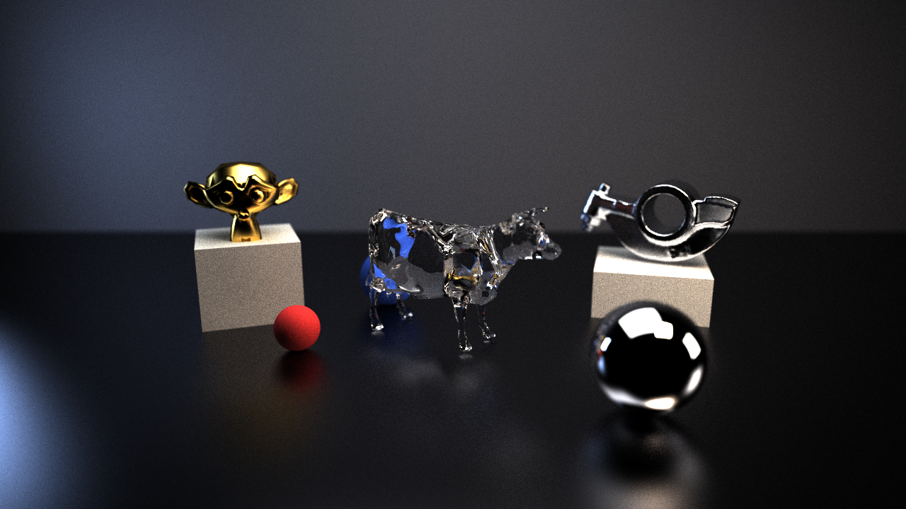

*Cover: a glass cow with a blue ball behind it, a gold Suzanne and a steel rocker arm, rendered at 2000 spp from `scenes/cover.json`.*

## Overview

* Diffuse and mirror materials, stream compaction, sorting by material, stochastic anti-aliasing
* Refraction with Fresnel, and rough metal
* Depth of field
* Russian roulette
* OBJ mesh loading with bounding-box culling
* Direct lighting on the last bounce
* Motion blur

Most of these can be toggled in the ImGui panel, which also shows the time per iteration and how many paths are still alive after each bounce.

**Build note: I changed `CMakeLists.txt`.** CUDA 13 doesn't compile with MSVC's old preprocessor, so I add `/Zc:preprocessor` for MSVC when the CUDA version is 13 or newer. Older setups build the same as before. I checked that CUDA 13.3 and 12.9 both build and render the same image.

## Core features

Diffuse surfaces use the provided cosine-weighted sampling, so a bounce just multiplies the path by the surface color. Mirrors use `glm::reflect`. When I set the sphere to diffuse, the average color of my image matched the reference exactly.

| Reference (left) vs mine (right), diffuse sphere | Mirror sphere, 5000 spp |
|---|---|
| 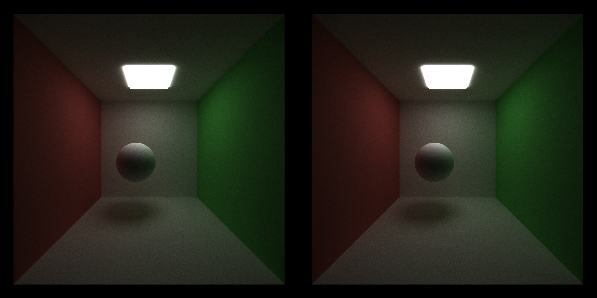 | 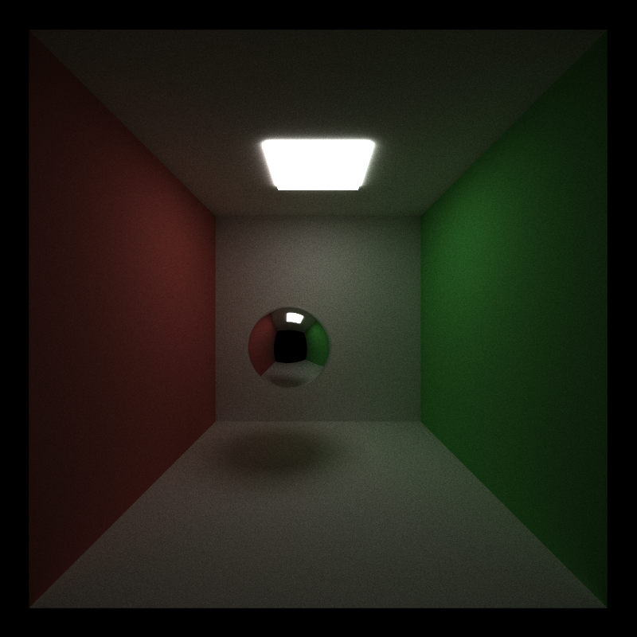 |

After each bounce, `thrust::partition` moves finished paths to the back so the next bounce only runs the live ones. Paths can also be sorted by material with `thrust::sort_by_key` before shading. Neither changes the image, since the random numbers are seeded by pixel and not by position in the array. Whether they actually help is in [Performance analysis](#performance-analysis).

For anti-aliasing, each iteration shoots through a random point inside the pixel. It made no measurable difference in speed (12.85 vs 12.83 ms).

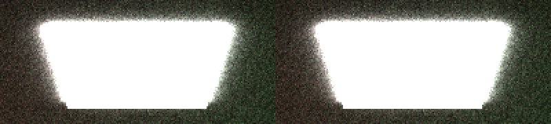

## Features

All timings use the setup described in [Benchmark setup](#benchmark-setup).

### Refraction and rough metal

The `Refractive` material randomly reflects or refracts with `glm::refract`, using Schlick's approximation for the chance of reflecting, and always reflects on total internal reflection. For rough metal, the `ROUGHNESS` field of `Specular` materials now does something: it becomes a Phong exponent, and the mirror direction is jittered inside a Phong lobe following GPU Gems 3, chapter 20, equations 7-9.

| Glass sphere, mirror sphere, blue sphere behind the glass | Gold spheres, roughness 0 / 0.15 / 0.4 |
|---|---|
| 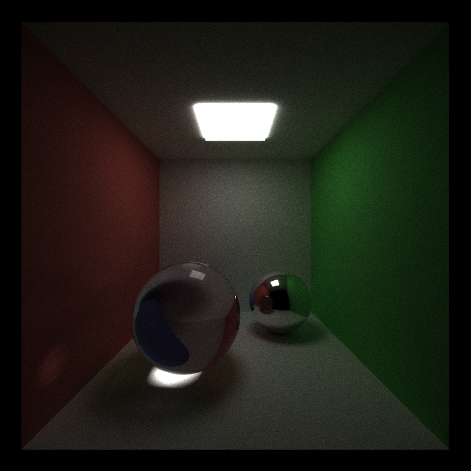 | 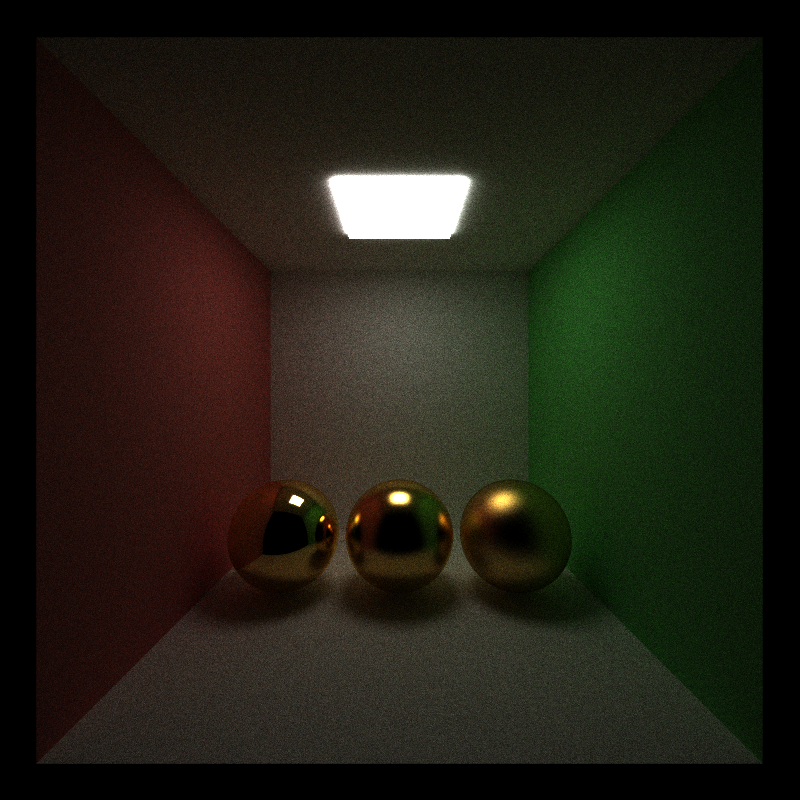 |

Both only add a little math to the shading kernel, which takes under 1 ms per iteration. Glass does keep paths alive longer, with 156k paths left after 7 bounces compared to 119k in the plain Cornell box, so intersection has more work. On the GPU each new material is another branch, and a warp that hits glass, metal and diffuse surfaces at once has to run all of them. A CPU wouldn't have that problem but also couldn't run nearly as many paths. One thing I'd improve is that samples jittered below the surface get dropped, so very rough metal comes out a bit too dark. A microfacet model like GGX would fix that.

### Depth of field

This is a thin lens camera (PBRTv4 5.2.3). Each ray starts from a random point on the lens and goes toward where the original ray would hit the focal plane. The lens radius and focal distance can be set in the scene file or with sliders in the GUI.

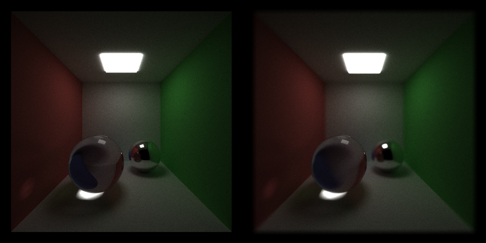

It costs nothing I could measure (14.42 vs 14.63 ms). It fits the GPU well because every camera ray does the same small calculation on its own. A CPU version would cost the same per ray, but it couldn't run nearly as many rays at once. It could be improved with concentric disk sampling for a more even lens, or a polygon-shaped aperture for bokeh.

### Russian roulette

From bounce 3 on, a path survives with a probability equal to its brightest color channel, and survivors are divided by that probability so the image stays the same on average. I start at bounce 3 because the first few bounces carry most of the light.

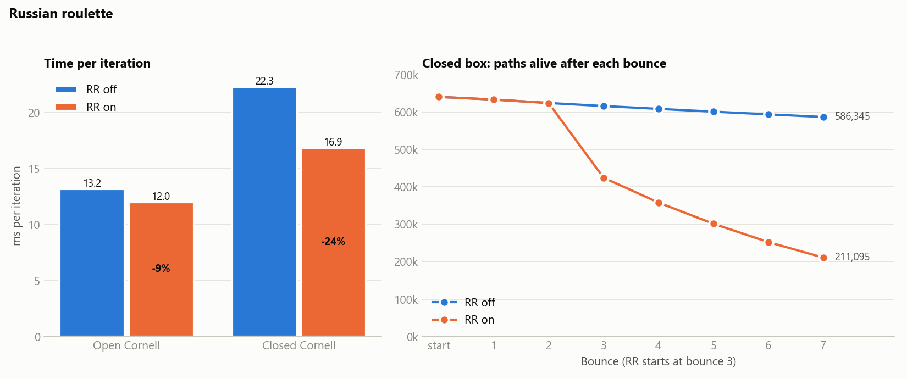

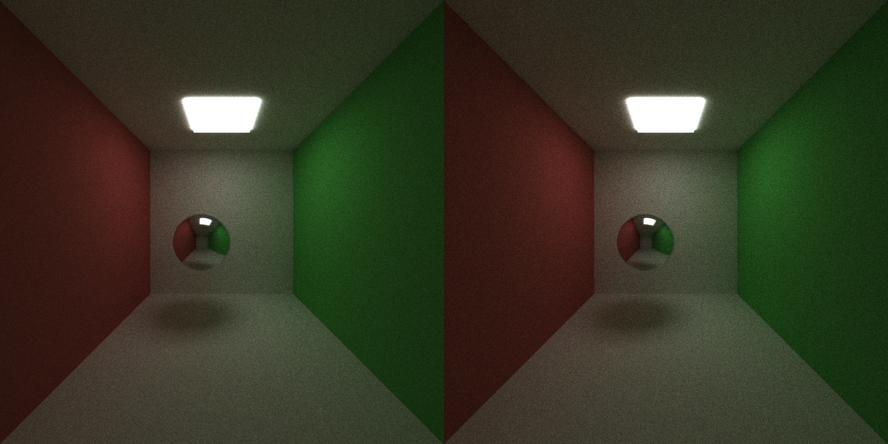

It cut the time per iteration by 9% in the open box (13.19 to 12.01 ms) and by 24% in the closed box (22.28 to 16.86 ms). It helps much more in the closed box because paths can't escape there. Without it, 586k of the 640k paths are still bouncing after 7 bounces, and with it only 211k are. The average brightness didn't change, but there is a bit more noise. On the GPU the savings come through stream compaction, because killed paths are removed and later bounces launch fewer threads. On a CPU it would just skip the work for those paths. A minimum survival chance like PBRT's 5% would stop dark paths from being cut too often.

### OBJ mesh loading and bounding-box culling

I wrote my own OBJ parser. Models are scaled to size 1, moved into world space once on the CPU, and smooth shaded. Intersection uses `glm::intersectRayTriangle`, tested from both sides so glass meshes work. With culling on, rays check the mesh's bounding box before any of its triangles.

| Suzanne, 968 triangles | Cow, 5,804 triangles | Rocker arm, 20,088 triangles |
|---|---|---|
| 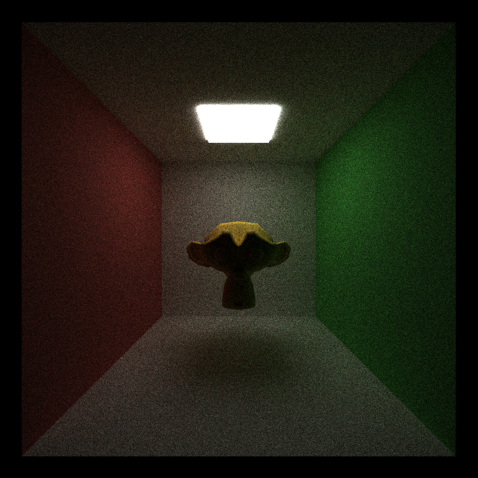 | 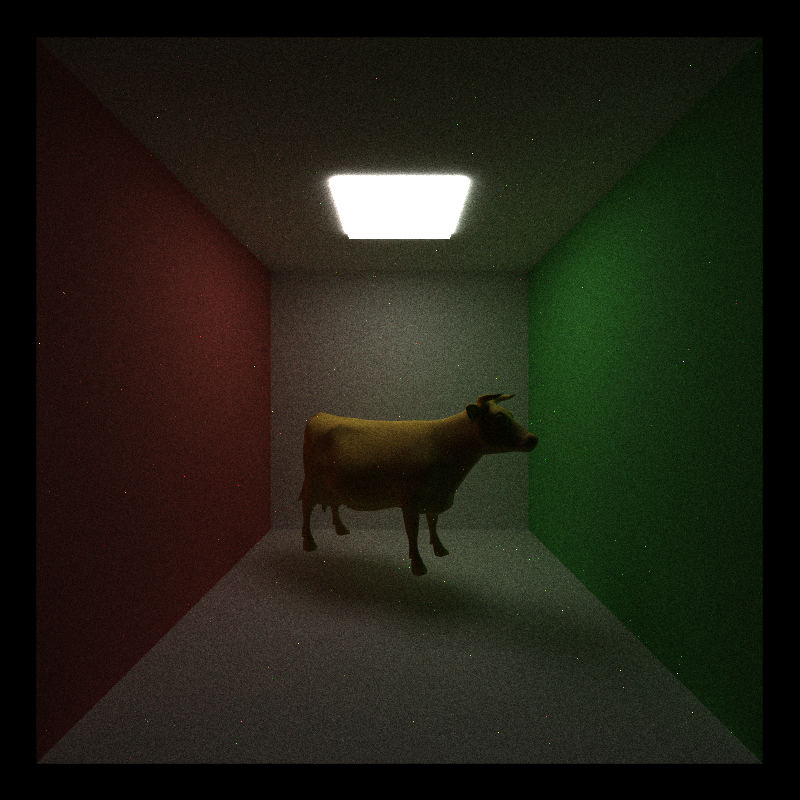 | 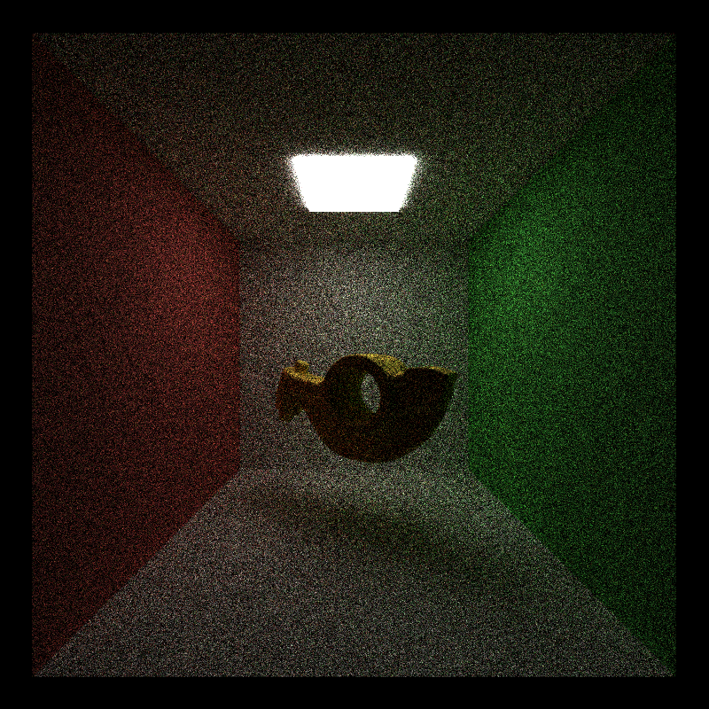 |

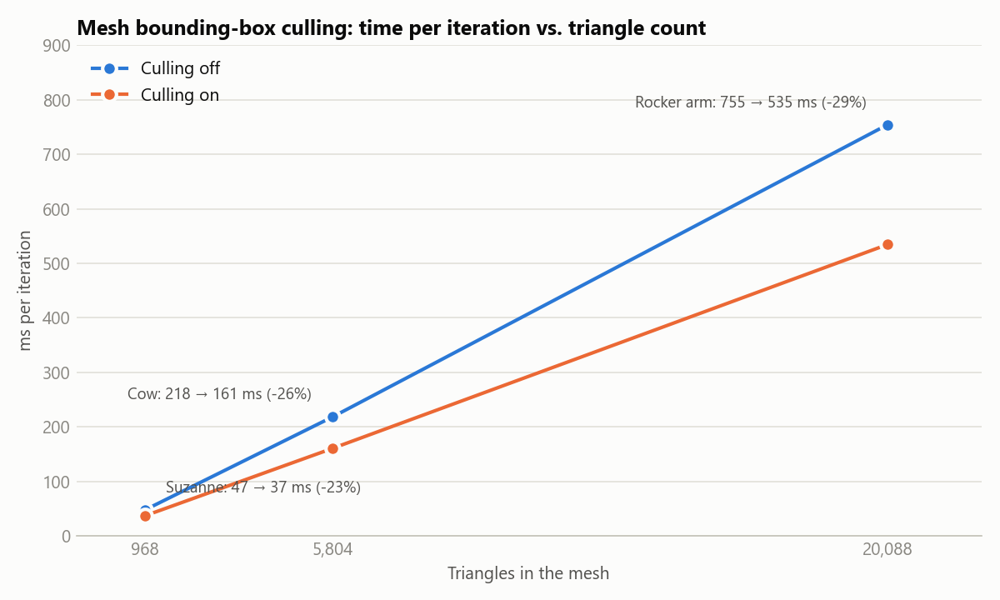

The time grows about linearly with the number of triangles, because every ray that reaches a mesh tests all of them. Culling saved 23-29%, and more for the bigger meshes, without changing the image. Moving the vertices into world space ahead of time also means rays never need to be transformed for meshes. The loop suits the GPU since every thread does the same thing, but every thread also reads all the triangles from global memory. A BVH would be the real fix, making the cost closer to logarithmic in the triangle count. Testing both sides of a triangle in one pass would also save work on misses.

### Direct lighting

When the next ray is a path's last one and the surface is diffuse, I aim it at a random point on a random light instead of bouncing randomly, weighted so the result stays unbiased. The light only counts if the ray actually reaches it, so I don't need a separate shadow ray.

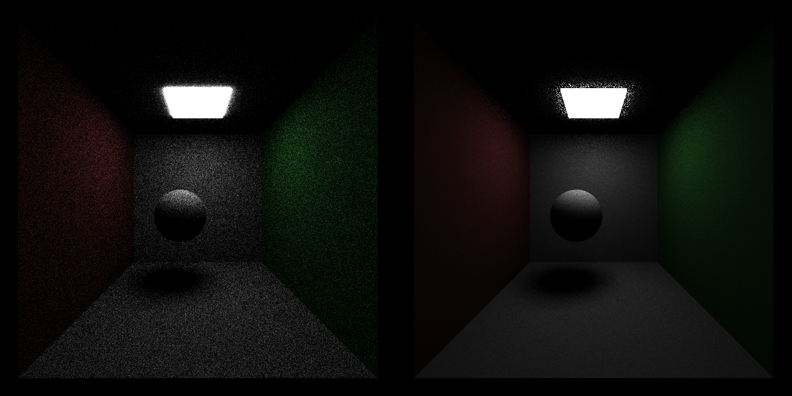

At depth 2 the image is a lot cleaner, with the error against a 3000 spp reference going from 13.5 to 10.1, and the average brightness stays the same. At depth 8 it barely helps, though, and points right next to the light get huge weights and show up as bright colored dots. In a 500 spp test I counted 175 of them with it on and 13 with it off, so I left it off by default. Speed didn't change (12.81 vs 12.80 ms). Reusing the normal intersection pass keeps the GPU code simple, while a CPU version could just cast a shadow ray. Sampling a light at every bounce and mixing it with BSDF sampling (MIS, PBRTv4 13.4) would fix both problems.

### Motion blur

Objects can have a `VELOCITY`, which is how far they move while the shutter is open. Each path gets a random time, and instead of moving the object I move the ray's origin backward by `velocity * time`, so all the intersection tests work unchanged.

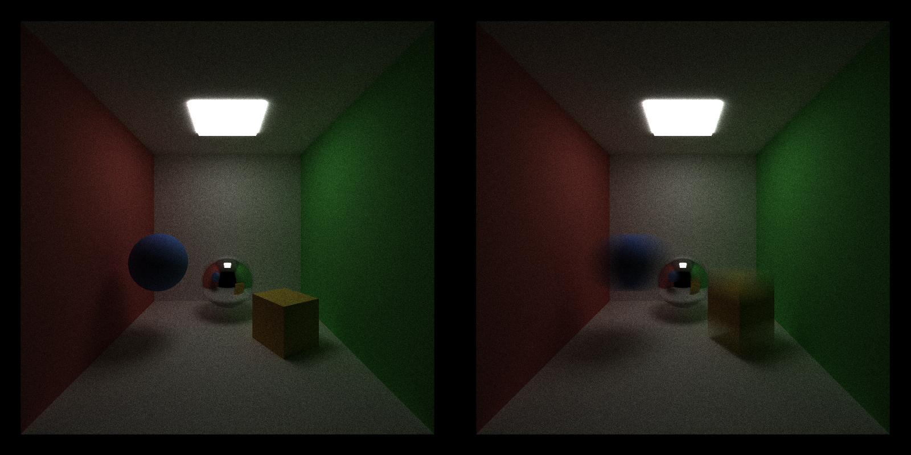

The mirror ball stays sharp, but its reflections of the moving objects blur, and so do the shadows, since each path sees the whole scene at one moment. There's no measurable cost (13.92 vs 13.80 ms). It would work the same way on a CPU, but the GPU can average a lot more moments. Rotation and curved motion would need a transform stored for several moments in time.

## Performance analysis

### Benchmark setup

The data is in `img/perf/benchmark_results_perfmode.json`. Tests ran on AC power in Windows performance mode at 800x800 and depth 8, with 60 to 300 iterations each. Unless a test is about one of these, compaction is on, sorting off, anti-aliasing on, Russian roulette off, culling on and direct lighting off. Runs vary by about 5%. For the Nsight Systems screenshots I profiled 20 iterations of each setup with the same settings.

### Stream compaction: open vs closed scenes

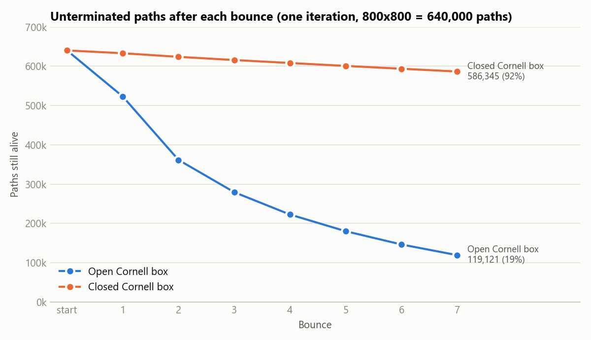

In the open box, rays escape through the open front, so only 19% of paths are left after 7 bounces. In the closed box I added a wall behind the camera, so paths only end at the light and 92% are left. Compaction can only remove finished paths, so I expected it to help a lot in the open box.

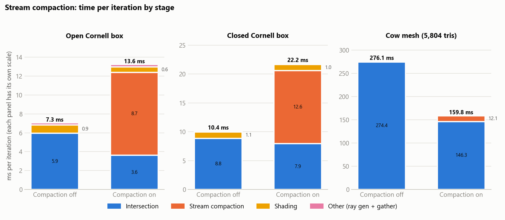

| Scene | Compaction off | Compaction on | Change |
|---|---|---|---|
| Open Cornell box | 7.26 ms | 13.57 ms | 87% slower |
| Closed Cornell box | 10.40 ms | 22.22 ms | 114% slower |
| Cow mesh | 276.08 ms | 159.77 ms | 42% faster |

It actually made both Cornell boxes slower, which I didn't expect, so I profiled one iteration of each with Nsight Systems.

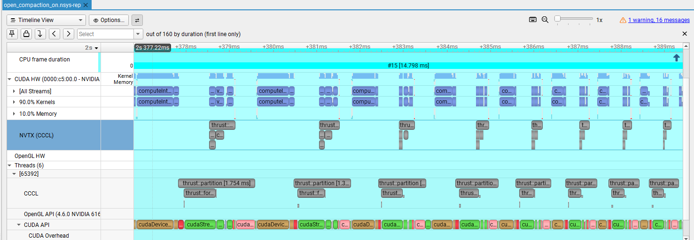

*Compaction on. The computeIntersections blocks get narrower every bounce, but each `thrust::partition` call in the CCCL row takes up to 1.75 ms while its own kernels are tiny. The CUDA API row below it is full of cudaMalloc, cudaFree and cudaStreamSynchronize.*

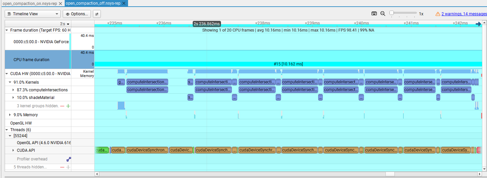

*Compaction off. All 8 computeIntersections launches are about the same length and run back to back.*

The profile showed that compaction does cut the GPU work. The kernels add up to 5.89 ms per iteration with compaction and 6.66 ms without, because intersection drops from 5.81 to 3.50 ms while the compaction kernels only take about 1.7 ms. The extra time is outside the kernels: thrust allocates and frees temporary memory on every call (32 cudaMalloc and cudaFree per iteration) and waits for the GPU to find out how many paths are left. With only 7 objects intersection is already cheap, so that overhead is more than compaction saves, and the closed box is worse because almost every path has to be moved. With the cow mesh intersection takes 274 ms, so the overhead doesn't matter and the whole iteration is 42% faster.

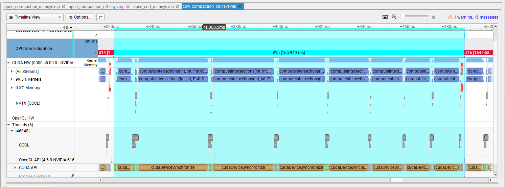

*Cow scene, compaction on. computeIntersections fills almost the whole 166 ms frame and the thrust calls in the CCCL row are thin slivers. The first bounce is short because most camera rays miss the cow's bounding box.*

So compaction only pays off when intersection is expensive, at least with how thrust handles memory here. Giving thrust a buffer that is allocated once, through a custom allocator, would remove most of that overhead.

### Sorting by material

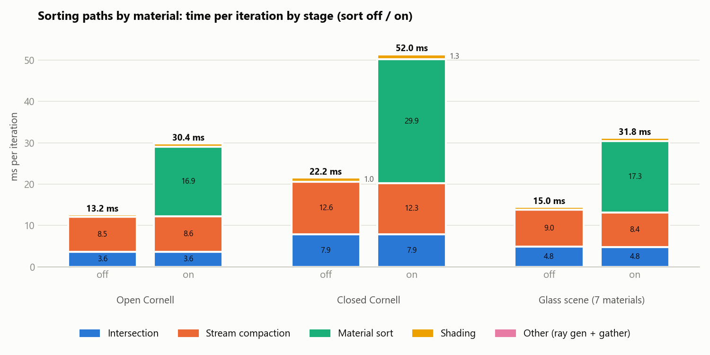

| Scene | Sort off | Sort on | Sorting | Shading |
|---|---|---|---|---|
| Open Cornell box | 13.22 ms | 30.44 ms | 16.90 ms | 0.7 ms |
| Closed Cornell box | 22.19 ms | 52.04 ms | 29.93 ms | 1.1 ms |
| Glass scene, 7 materials | 15.03 ms | 31.80 ms | 17.28 ms | 0.7 ms |

Sorting made every scene 2.1-2.3x slower.

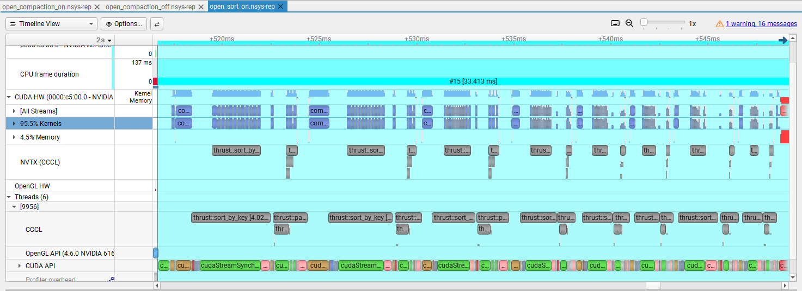

*Sorting on. Every bounce now has a `thrust::sort_by_key` call, 4 ms for the first bounce, made of many small merge sort kernels.*

It's supposed to reduce warp divergence during shading, and to check that it does, I measured `shadeMaterial` in the glass scene with Nsight Compute:

| | Sort off | Sort on |
|---|---|---|
| Active threads per warp, bounces 2-7 | about 16 of 32 | about 28 of 32 |
| Active threads per warp, average of all 8 bounces | 61% | 91% |
| Branches taken the same way by the whole warp | 85% | 99% |
| Shading kernel time, bounces 3-8 (bounce 2 had a measuring outlier) | 0.55 ms | 0.49 ms |

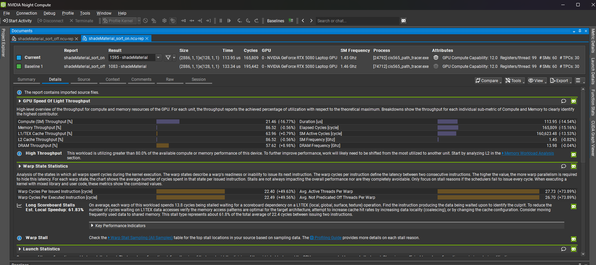

*Nsight Compute on bounce 3, sort on with sort off as the baseline. Active threads per warp go up 74%, but the kernel is only 14.5% faster, and memory throughput stays at 86.5%.*

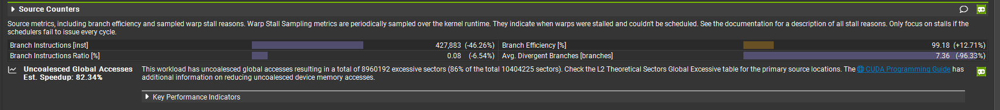

*Same bounce 3: branch efficiency goes from 88% to 99%, and divergent branches drop by 96%.*

So sorting works: without it about half the threads in a warp sit idle in bounces 2-7, and with it almost all of them are busy. Bounce 1 is already at 97% without sorting because neighboring camera rays hit the same object.

It still doesn't pay off, for three reasons. First, the sort is expensive: in the Nsight Systems profile the merge sort kernels take 60% of the GPU time, 9 ms per iteration over 160 launches, plus the same allocation and waiting as with compaction. Thrust uses merge sort because I sort whole structs with my own comparator. Second, shading only takes about 1 ms per iteration, so the fuller warps save only about 0.06 ms. Third, even the shading kernel only got 14.5% faster, because `shadeMaterial` is limited by memory, not by divergence. It already uses 86.5% of the memory throughput and spends most of its time waiting on loads of the big `PathSegment` and intersection structs, which Nsight also flags as uncoalesced.

To make sorting worth it, I would sort only the integer material IDs so thrust can use a radix sort, and store paths as separate arrays (structure of arrays) instead of an array of structs. I think it would also start to pay off with many materials that are expensive to shade.

## Base code fix and scene format

The base code flipped cameras that look up or down, which put my tilted cover camera under the floor, and it mirrored off-center ones. I fixed the angle calculation in `main.cpp`. Level cameras render the same as before.

New scene fields, all optional:

| Field | Used for |
|---|---|
| Refractive material, IOR | Glass |
| ROUGHNESS on Specular materials | Rough metal |
| LENS_RADIUS, FOCAL_DIST on the camera | Depth of field |
| mesh objects with a FILE | Loading an OBJ model |
| SMOOTH on meshes | Smooth or flat shading |
| VELOCITY on objects | Motion blur |

## Bloopers

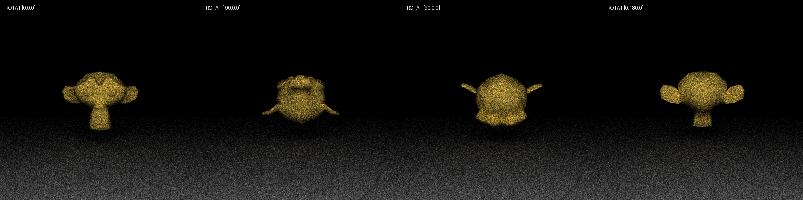

Under the Cornell box's top light I mistook the top of Suzanne's head for its face and rotated it -90 degrees. Lighting it from the front showed it needed no rotation at all. From left to right the image shows no rotation, -90 and +90 about X, and 180 about Y.

## Credits

* Third-party code: none besides what the base code includes (glm, ImGui, nlohmann json, stb) and thrust.
* Models from [common-3d-test-models](https://github.com/alecjacobson/common-3d-test-models): Suzanne from Blender, the cow from Viewpoint Animation Engineering / Sun Microsystems, and the rocker arm from INRIA.
* References: [PBRTv4](https://pbr-book.org/4ed/contents), [PBRTv3](https://www.pbr-book.org/3ed-2018/contents) section 13.7, [GPU Gems 3 chapter 20](https://developer.nvidia.com/gpugems/gpugems3/part-iii-rendering/chapter-20-gpu-based-importance-sampling), and [Paul Bourke's anti-aliasing notes](https://paulbourke.net/miscellaneous/raytracing/).
